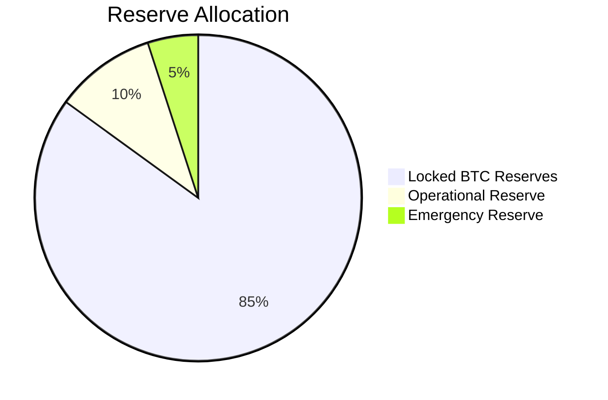

## Treasury

The project is backed by a treasury of $20,000,000,000 (Twenty Billion USD), secured entirely through cash donations. This capital underwrites operations, collateralizes the treasury, and guarantees long term financial sovereignty and stability.

## Runway and Reserves

Assume multi year runway with risk reserves for audits and incident response.

## Reserves Attestations and SPV Roadmap

The BLOOM token maintains a hard peg of 10 BLOOM = 1 BTC, backed by locked Bitcoin reserves. The Proof of Reserves system provides verifiable evidence of collateralization through:

- **SPV Verification**: Simplified Payment Verification of Bitcoin UTXOs
- **Reserve Attestations**: Regular third-party audits of locked reserves
- **Transparent Reporting**: Public reserve statements and verification
- **Fallback Mechanisms**: Static reserve feeds for demo and testing

The SPV roadmap includes:
1. **Phase 1**: Basic UTXO monitoring (current)
2. **Phase 2**: Full SPV verification with Merkle proofs
3. **Phase 3**: Multi-signature reserve management
4. **Phase 4**: Decentralized reserve verification

See [Proof of Reserves](/tokenomics/proof-of-reserves) for detailed specifications.

## Collateralization Monitoring

### Current Reserve Status

### Collateralization Ratio

The collateralization ratio measures the relationship between locked Bitcoin reserves and outstanding BLOOM tokens:

- **Target Ratio**: 100% (1:1 backing)
- **Current Ratio**: 100% (fully collateralized)
- **Minimum Ratio**: 100% (peg enforcement)
- **Alert Threshold**: 95% (warning level)

### Reserve Monitoring

Real-time monitoring of reserve status includes:

- **UTXO Tracking**: Continuous monitoring of Bitcoin UTXOs
- **Attestation Verification**: Regular verification of reserve attestations
- **Collateralization Alerts**: Automated alerts for ratio changes
- **Audit Trail**: Complete audit trail of reserve changes

## Governance

High level governance model with technical steering, risk, and treasury oversight.

### Governance Structure

- **Technical Committee**: Protocol development and security
- **Treasury Committee**: Financial management and oversight
- **Community Council**: Community representation and feedback
- **Audit Committee**: Independent audit and compliance

### Decision Making Process

1. **Proposal Submission**: Community or committee proposals
2. **Technical Review**: Technical feasibility assessment
3. **Financial Review**: Financial impact analysis
4. **Community Vote**: Community approval process
5. **Implementation**: Controlled implementation with monitoring

### Treasury Management

- **Multi-Signature Control**: 3-of-5 signature requirement
- **Regular Audits**: Quarterly financial audits
- **Transparent Reporting**: Monthly treasury reports
- **Emergency Procedures**: Emergency fund access procedures

See [Governance v0](/governance-v0) for detailed governance procedures.

