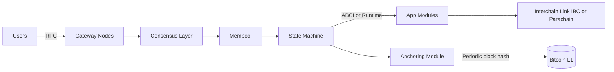

```mermaid
%% id: arch-l1
flowchart LR
    U[Users] -->|RPC| G[Gateway Nodes]
    G --> C[Consensus Layer]
    C --> M[Mempool]
    M --> S[State Machine]
    S -->|ABCI or Runtime| A[App Modules]
    A --> IBC[Interchain Link IBC or Parachain]
    S --> BTC[Anchoring Module]
    BTC -->|Periodic block hash| B[(Bitcoin L1)]
```

